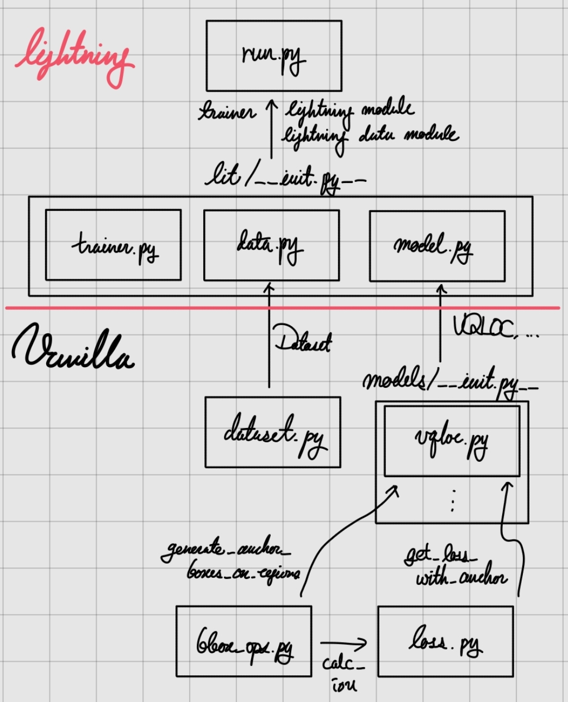

# Lightning Implementation of VQ2D Models

<center>

</center>

## Currently Working on

### Prototyping

- [x] Dataset
  - [x] Build DINOv2 and check if outputs are reasonable: shouldn't generate the same values
- [x] Metrics
- [ ] Evaluation
  - [x] Define and/or refactor configs
  - [ ] Predict
    - [x] Save per-segment `.pt` files
    - [ ] Skip segments already predicted
    - [ ] Add force-overwrite option
  - [ ] Post-process
  - [ ] Compute metrics
  - [ ] Log
    - [ ] Log and load wandb run id
    - [ ] Report the result to the existing wandb run
- [x] Loss
- [x] Training
- [ ] README
  - [ ] Preparing Data
    - [ ] Download
    - [ ] Preprocess

### The Initial Sanity Check

- [x] Check if evaluation from official weight generates the same score.
- [x] Check if `VQLoC-from-scratch` is correctly reproduced.

### Sanity Check Automation

- [ ] Build an unittest that runs training for a few tens of steps and check if the results are the same as before.
- [ ] Register this test to a github action, letting it submit an sbatch script when pushed.

### Implementations

#### VQ2D

- VQLoC

#### NLQ

- GroundVQA

---

## Quick Start

### Environment Setup

```bash
# conda (recommended)
conda create -n vq2d-lit python=3.12 -y
conda activate vq2d-lit
```

```bash
# install packages
pip install -r requirements.txt
```

### Train

#### Get Frames for Train

```bash
# 1. Extract video frames:
bash scripts/extract_frames.sh  # -> ./outputs/frames/vq2d_pos_and_query_frames_{SHORTSIDE}ss.tar

# 2. Unpack frames:
tar -xvf TARFILE -C BASEDIR  # -> BASEDIR/ego4d_data/v2/vq2d_frames/{SHORTSIDE}ss/{CLIPUID}/frame_{FRAMEIDX}.jpg, index is 1-based
```

#### Run

```bash
# for baselines
bash scripts/train-baseline.sbatch

# OR

# for ours
bash scripts/train.sbatch
```

Indeed, you can submit the script itself to Slurm.

### Evaluation

#### Get Frames for Eval

```bash
# 1. Extract video frames:
bash scripts/extract_frames_val.sh  # -> ./outputs/frames/vq2d_pos_and_query_frames_{SHORTSIDE}ss-val.tar

# 2. Unpack frames:
tar -xvf TARFILE -C BASEDIR  # -> BASEDIR/ego4d_data/v2/vq2d_frames/{SHORTSIDE}ss/{CLIPUID}/frame_{FRAMEIDX}.jpg, index is 1-based
```

```bash
bash scripts/eval.sbatch
```

### Debug

#### Check Hydra Configuration

You can inspect Hydra configurations without running the code:

```bash
python train.py --cfg job        # Print job config
python train.py --cfg hydra      # Print Hydra config (check runtime dir, packages, etc.)
python train.py --cfg job --resolve  # Print resolved config (requires SLURM_JOB_ID)
python train.py -i               # Print gathered config without running
```

### Verify Initial Training Steps

```bash
python train,py --config-name 'config/debug.yaml'
```
